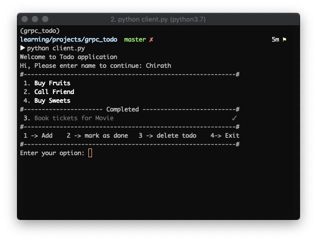

### ToDo

A ToDo CLI program that uses gRPC to communicate between client and server.

To generate the protocol buffer and gRPC client classes execute the command from inside the `protobuf/` directory:

### Installation

```bash
pip install -r requirement.txt
```

### Usage

```bash
python -m grpc_tools.protoc -I./  --python_out=. --grpc_python_out=. todo.proto
```

To run the program, execute the server script.

```bash
python server.py
```

Then run the client script in a new terminal.

```bash
python client.py
```

### Testing

All the core modules have unit tests. To run all tests use the command:

```bash
pytest -v
```

This will also create covrage html report and save it in the `htmlcov` file.

#### Screenshots


